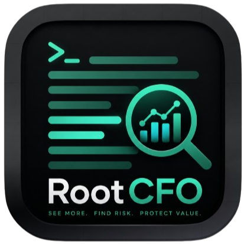
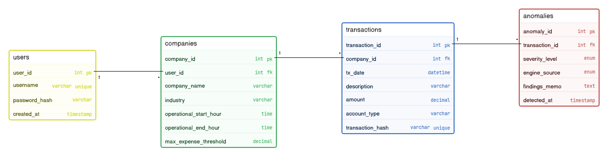

<p align="center">
  
</p>

<p align="center">
  <a href="https://github.com/"></a>
  <a href="https://www.python.org/"></a>
  <a href="https://textual.textualize.io/"></a>
</p>

## 1. Overview

RootCFO is an interactive terminal-based financial intelligence application built in Python using the Textual framework. It detects internal fraud, suspicious transactions, and ledger inconsistencies for SMEs. The system accepts CSV/JSON financial records, validates them, stores them in MySQL (Aiven), runs deterministic statistical anomaly detection (duplicate detection, off-hours analysis, Benford's Law), then ships flagged data to the Groq LLM API for forensic narrative analysis. Results are displayed in a color-coded TUI with follow-up chat capability.

## 2. Project Structure

```
rootcfo/
├── main.py                      # Entry point
├── app.py                       # RootCFOApp (Textual App subclass)
├── .env                         # DB creds, API keys (gitignored)
├── .env.example                 # Template for teammates
├── requirements.txt             # Dependencies
├── pyproject.toml               # Project metadata
├── README.md                    # Setup & usage instructions
├── sql/
│   └── schema.sql               # Table creation scripts (Juliana)
├── screens/
│   ├── __init__.py
│   ├── auth_screen.py           # Login/Signup tabs (Bruce)
│   ├── onboarding.py            # Business profile form (Bruce)
│   ├── dashboard.py             # Master dashboard + sidebar (David)
│   ├── ingestion.py             # CSV/JSON file import (Juliana)
│   ├── forensic_log.py          # Color-coded anomaly table (Calvin)
│   └── report.py                # AI report + follow-up chat (Calvin)
├── models/
│   ├── __init__.py
│   ├── user.py                  # User, Company dataclasses (Bruce)
│   ├── transaction.py           # Transaction dataclass (Jimmy)
│   └── anomaly.py               # Anomaly dataclass (Elyse)
├── services/
│   ├── __init__.py
│   ├── db.py                    # MySQL CRUD wrapper (Priscilla)
│   ├── parser.py                # CSV/JSON ingestion & validation (Elyse)
│   ├── detector.py              # Statistical anomaly engine (Jimmy)
│   └── ai_forensic.py           # Groq API client (David)
└── utils/
    ├── __init__.py
    ├── config.py                # Env var loading (Priscilla)
    └── logger.py                # Audit log formatter
```

---

## 3. Dependencies

- `textual` — TUI framework
- `mysql-connector-python` — MySQL driver
- `groq` — Groq API client
- `python-dotenv` — Environment variable loading
- `pandas` — CSV/JSON parsing helpers
- `bcrypt` — Password hashing

---

## 4. Database Schema



## 5. Services Architecture

### 5.1 `services/db.py` — DatabaseManager

- `connect()` / `disconnect()` — MySQL connection lifecycle
- `execute_query(sql, params)` — Parameterized query execution
- `insert_many(table, records)` — Bulk insert for parsed transactions
- `fetch_companies()`, `fetch_transactions(company_id)`, `fetch_anomalies(company_id)`

### 5.2 `services/parser.py` — FileParser

- `detect_format(filepath)` — CSV vs JSON detection
- `validate_columns(df)` — Ensure required columns exist
- `parse(filepath)` → `list[Transaction]` — Full pipeline
- Raises `ParserError` for malformed files (caught by screen, shown as notification)

### 5.3 `services/detector.py` — AnomalyDetector

- `find_duplicates(transactions)` — Same description + amount pairs
- `find_off_hours(transactions, business_hours)` — Out-of-window timestamps
- `benfords_test(transactions)` — First-digit distribution analysis
- `threshold_breaker(transactions, threshold=10000)` — Amounts exceeding configurable limit (default from `config.py`)
- Returns `list[Anomaly]`

### 5.4 `services/ai_forensic.py` — AIForensic

- `analyze(anomalies, transactions)` — Batch flagged data, send to Groq, return narrative
- `chat(history, question)` — Follow-up Q&A on a report
- Handles timeout/rate-limit errors gracefully
- Structured JSON prompt engineering for consistent forensic output

---

## 6. UI Screens (Textual)

### 6.1 AuthScreen (Bruce)

- `TabbedContent` with Login / Signup tabs
- Username + Password inputs; signup adds company name
- Push `OnboardingScreen` (new user) or `DashboardScreen` (existing)

### 6.2 OnboardingScreen (Bruce)

- Form: company name, email, address, business hours
- Creates Company + User in DB → push DashboardScreen

### 6.3 DashboardScreen (David)

- `VerticalLayout`: sidebar (fixed width) + main content + bottom audit console
- Sidebar buttons: Dashboard, Ledger Ingestion, Forensic Log, Settings
- Bottom `RichLog` for live audit stream
- Main pane switches per sidebar selection (default: summary stats)

### 6.4 IngestionScreen (Juliana)

- `Input` for file path + "Import" button
- Calls parser → inserts to DB → shows result in audit pane
- Color-coded status messages (`[OK]`, `[WARN]`, `[ERR]`)

### 6.5 ForensicLogScreen (Calvin)

- `DataTable` with sortable columns
- Rows: red=critical, yellow=warning, blue=info
- Click → push ReportScreen with anomaly details

### 6.6 ReportScreen (Calvin)

- Left: scrollable AI report (`MarkdownViewer`)
- Bottom chat bar: `Input` + "Ask" button for follow-up questions to Groq

---

## 7. Error Handling Strategy

| Layer   | Mechanism                                                      |
| ------- | -------------------------------------------------------------- |
| UI      | Textual `Notification` toast for user-facing messages          |
| Service | Custom exceptions (`ParserError`, `DatabaseError`, `APIError`) |
| DB      | Wrapped `mysql.connector` errors → audit pane log              |

---

## 8. How to run

### Prerequisites

- Python 3.12+
- Aiven MySQL Server

#### 1) Clone the repo

```bash
git clone https://github.com/ndizeyedavid/RootCFO
cd RootCFO
```

#### 2) Create a virtual environment

```bash
python3 -m venv .venv
source .venv/bin/activate
```

#### 3) Install all dependencies

```bash
pip install --upgrade pip setuptools wheel
pip install -r requirements.txt
```

#### 4) Run the app

```bash
python3 main.py
```

## 9. Team Assignments

| Member    | Responsibility                                                      |
| --------- | ------------------------------------------------------------------- |
| David     | `services/ai_forensic.py`, `app.py`, `screens/dashboard.py`         |
| Jimmy     | `services/detector.py`, `models/transaction.py`                     |
| Bruce     | `screens/auth_screen.py`, `screens/onboarding.py`, `models/user.py` |
| Elyse     | `services/parser.py`, `models/anomaly.py`                           |
| Calvin    | `screens/report.py`, `screens/forensic_log.py`                      |
| Juliana   | `screens/ingestion.py`, `sql/schema.sql`                            |
| Priscilla | `services/db.py`, `utils/config.py`                                 |

---

## 10. Screenshots

--- WE WILL ADD THEM LATER ---
